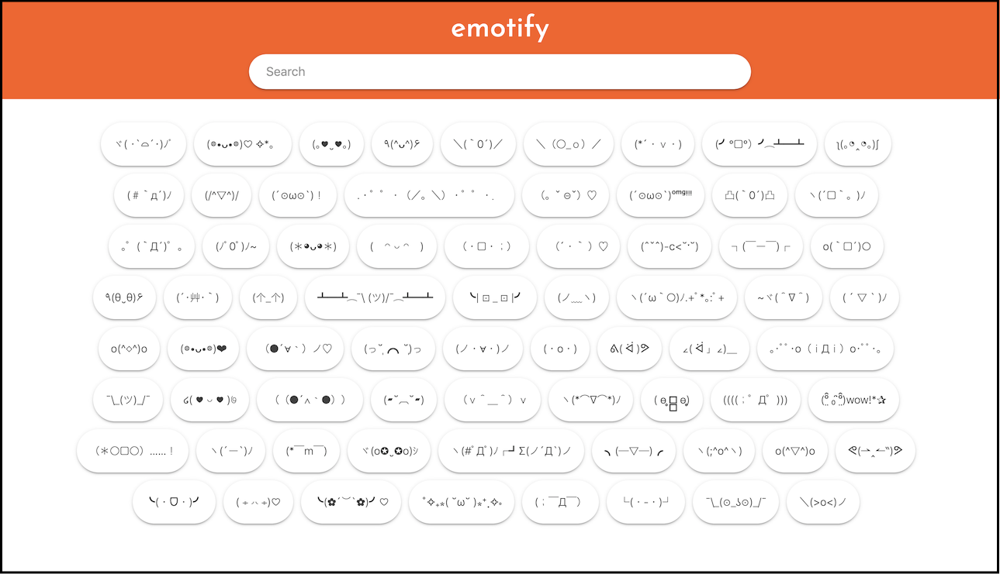

# Emotify

Source code for Emotify web app.

Build with
 - Angular
 - Firebase
 - MaterializeCSS 

#### Screenshot

### Licence

This project, as all other projects under RionLabs is licensed under [MIT](LICENSE) licence.